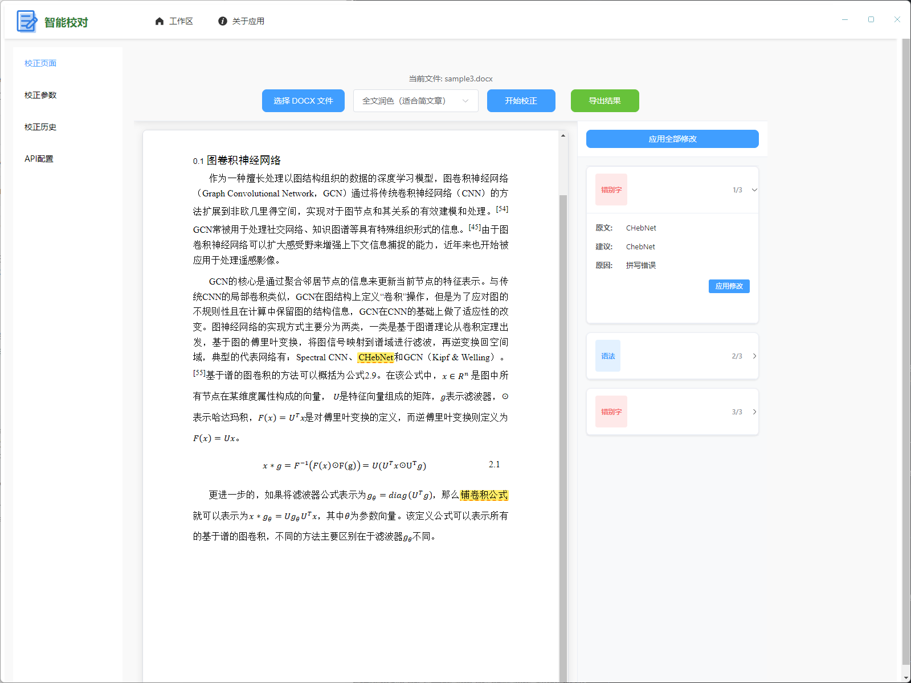
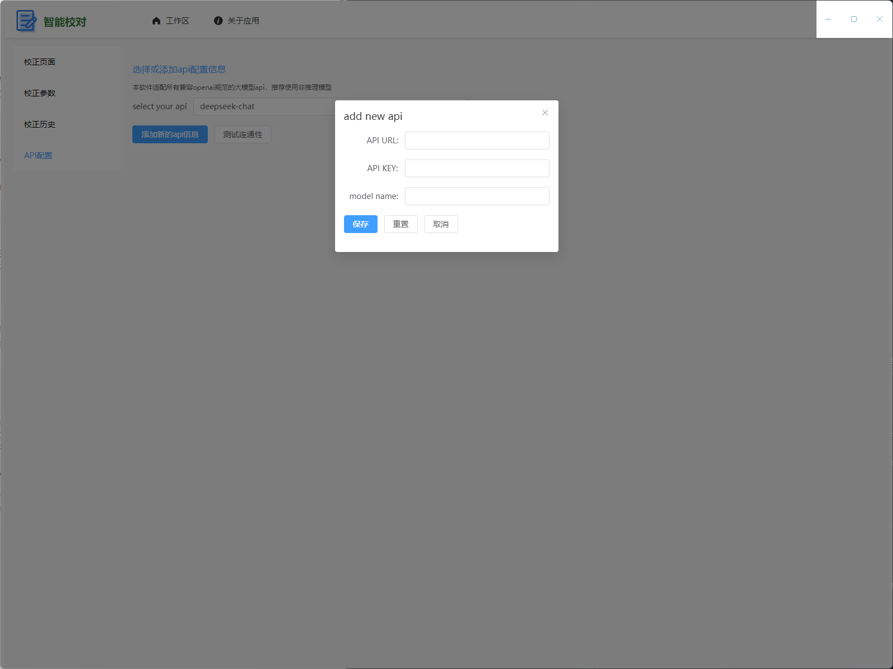
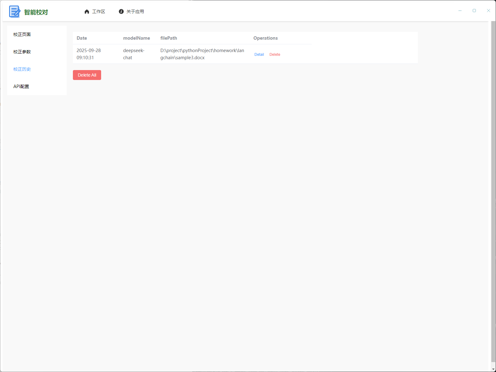

# AutoDocxProof 智能文档校对应用

<p align="center">
  
</p>

<p align="center">
  一款基于 Electron、Vue 3 和 TypeScript 构建的智能文档校对桌面应用程序
</p>

## 📝 项目简介

AutoDocxProofread（智能校对）是一款专为长文档校对而设计的桌面应用程序。它能够帮助用户有效检测 Word 文档中的错别字、标点符号错误、语法问题和文本一致性问题，并提供修改建议。
针对大模型在处理长文档的时候存在的遗忘和幻觉问题，软件设计了专门的架构来增强校对的准确性，并能直接导出校对后的文档

### 核心功能

- **多种校对模式**：

  - 逐句精校：适合需要高精度校对的短文本
  - 逐段校正：适合长篇文献的校对
  - 全文润色：对整篇文档进行语言润色和优化

- **智能错误识别**：

  - 错别字检测
  - 标点符号错误识别
  - 语法问题检测
  - 文本一致性检查

- **友好的用户界面**：

  - 实时文档预览
  - 清晰的错误展示和修改建议
  - 一键应用修改建议

- **API 配置管理**：
  - 支持多种大语言模型 API
  - 灵活的 API 配置管理
  - API 可用性测试

### 使用展示

在选择需要校对的文档后，再选择校对模式，然后开始校对，软件会将将对的结果显示在右边栏，并在文本中高亮展示，以方便查看。然后可以选择是否接受这些修改，可以导出接受修改后的文档

本应用可以自行设置api，兼容满足openai规范的api接口，推荐使用非推理模型

本应用还可以浏览和管理校对记录


## 🛠 技术栈

- **主框架**：[Electron](https://www.electronjs.org/) + [Vue 3](https://vuejs.org/) + [TypeScript](https://www.typescriptlang.org/)
- **UI 组件库**：[Element Plus](https://element-plus.org/)
- **构建工具**：[Vite](https://vitejs.dev/) + [Electron Forge](https://www.electronforge.io/)
- **文档处理**：[Mammoth](https://github.com/mwilliamson/mammoth.js) + [Docxtemplater](https://github.com/open-xml-templating/docxtemplater)
- **数据库**：[SQLite](https://www.sqlite.org/)
- **代码规范**：[ESLint](https://eslint.org/) + [Prettier](https://prettier.io/)
- **版本管理**：[Standard Version](https://github.com/conventional-changelog/standard-version)

## 🚀 快速开始

### 环境要求

- Node.js >= 16.x
- npm 或 yarn

### 安装依赖

```bash
npm install
```

### 开发模式运行

```bash
npm run start
```

### 构建可执行文件（无需安装）

```bash
npm run package
```

### 制作安装包

```bash
npm run make
```

根据不同操作系统生成相应的安装包，位于 `out/make` 目录中：

- Windows: `.exe` 或 `.msi` 安装包
- macOS: `.dmg` 或 `.pkg` 安装包
- Linux: `.deb` 或 `.rpm` 安装包

## 📦 项目结构

```
.
├── src/
│   ├── main/              # 主进程代码
│   │   ├── chat.ts        # AI 对话相关功能
│   │   ├── database.ts    # 数据库操作
│   │   ├── ipcHandlers.ts # IPC 通信处理
│   │   ├── main.ts        # 主进程入口
│   │   ├── preload.ts     # 预加载脚本
│   │   ├── proof.ts       # 文档校对核心逻辑
│   │   └── wordProcess.ts # Word 文档处理
│   └── renderer/          # 渲染进程代码
│       ├── router/        # 路由配置
│       ├── views/         # 页面组件
│       ├── App.vue        # 根组件
│       └── renderer.ts    # 渲染进程入口
├── assets/                # 静态资源
├── out/                   # 构建输出目录
└── forge.config.ts        # Electron Forge 配置
```

## 🎯 使用指南

### 1. 配置 API

首次使用需要配置支持的大语言模型 API：

1. 点击导航栏中的"工作区"
2. 选择"API 设置"选项卡
3. 填写 API 地址、密钥和模型名称
4. 点击"测试连接"验证配置
5. 点击"保存配置"保存设置

### 2. 文档校对

1. 点击导航栏中的"工作区"
2. 选择"文档校对"选项卡
3. 点击"选择 DOCX 文件"按钮选择要校对的 Word 文档
4. 选择合适的校对模式：
   - **逐句精校**：适合需要高精度校对的短文本
   - **逐段校正**：适合长篇文献的校对
   - **全文润色**：对整篇文档进行语言润色和优化
5. 点击"开始校正"按钮开始校对过程
6. 在右侧栏查看校对结果和修改建议
7. 点击"应用修改"按钮接受建议的修改
8. 点击"导出结果"按钮保存修改后的文档

## 📖 版本情况

v1.0.1版本的.exe包已经发布，可以在本项目页面上下载
