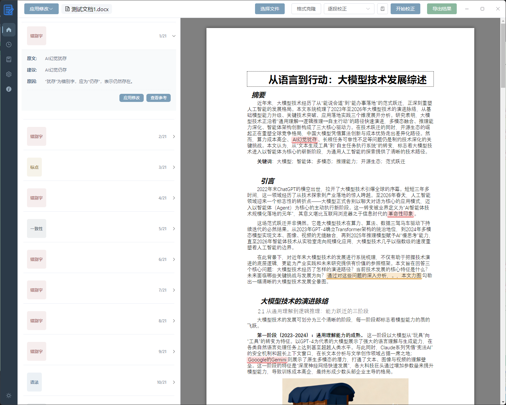
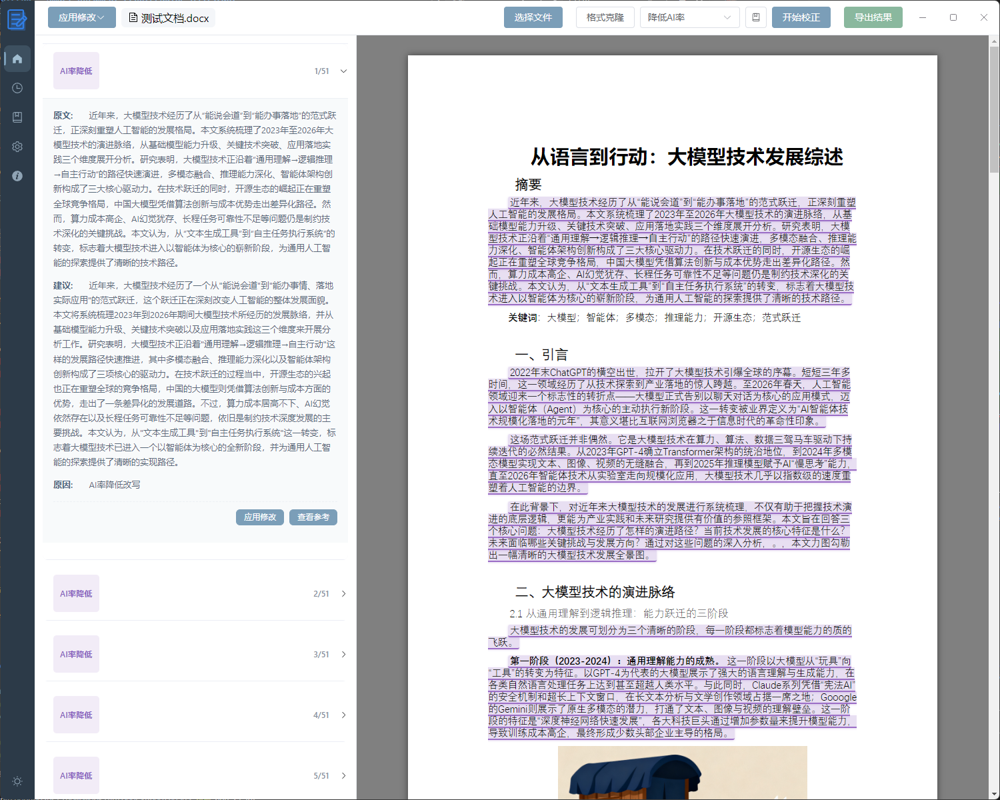
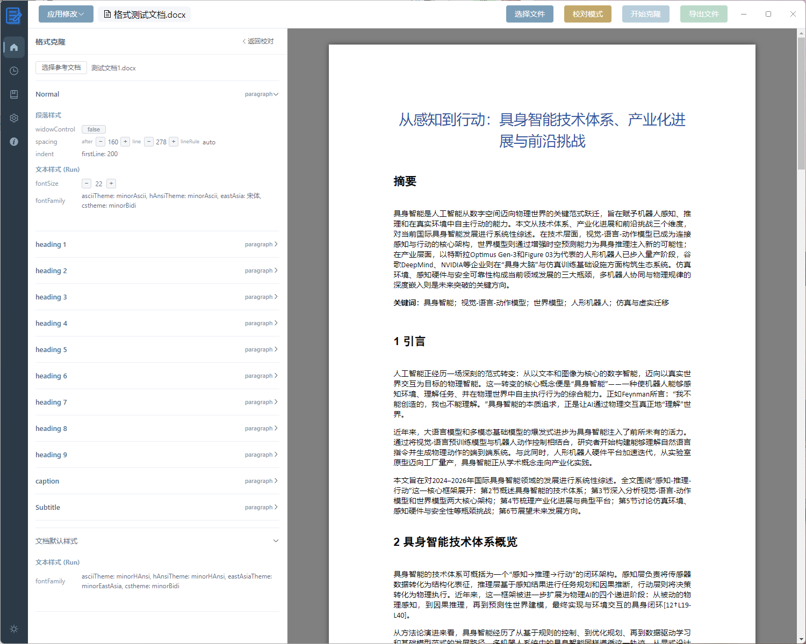
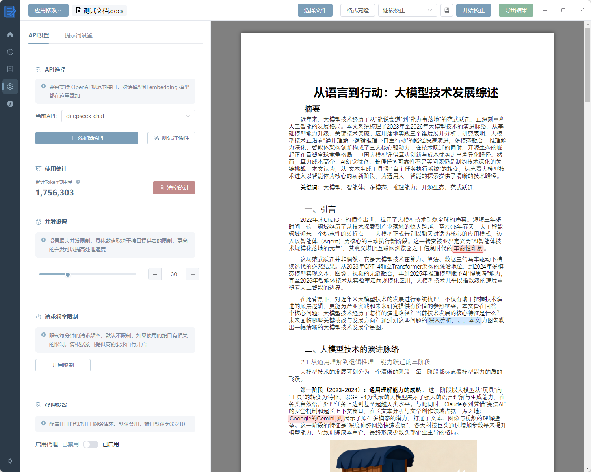
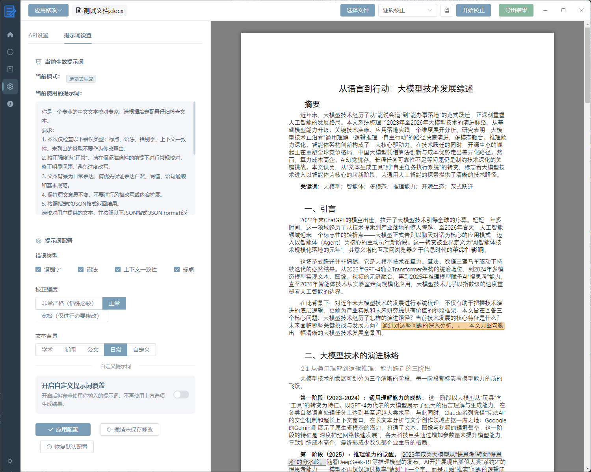
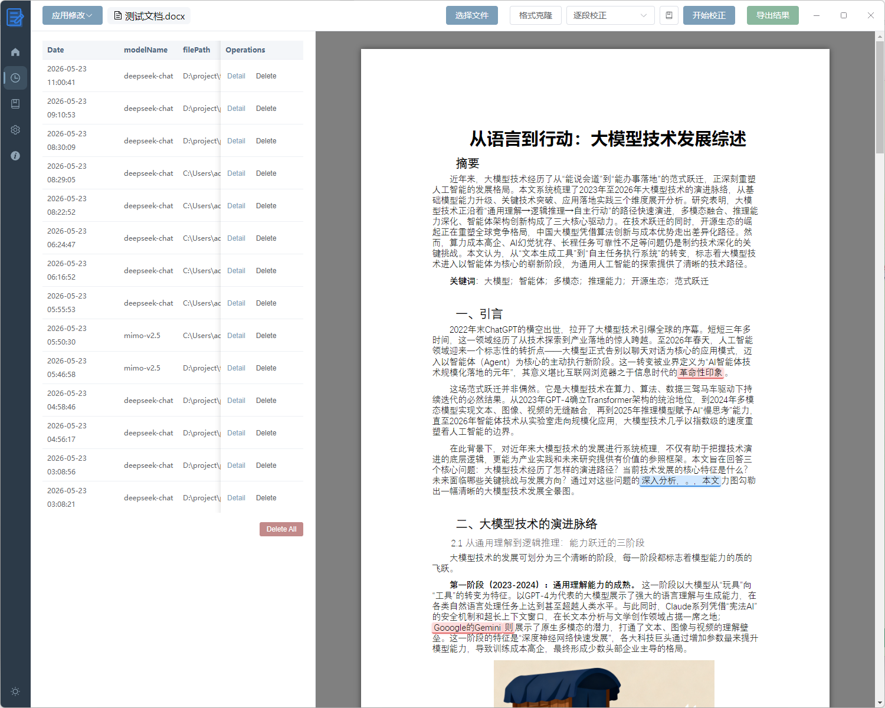
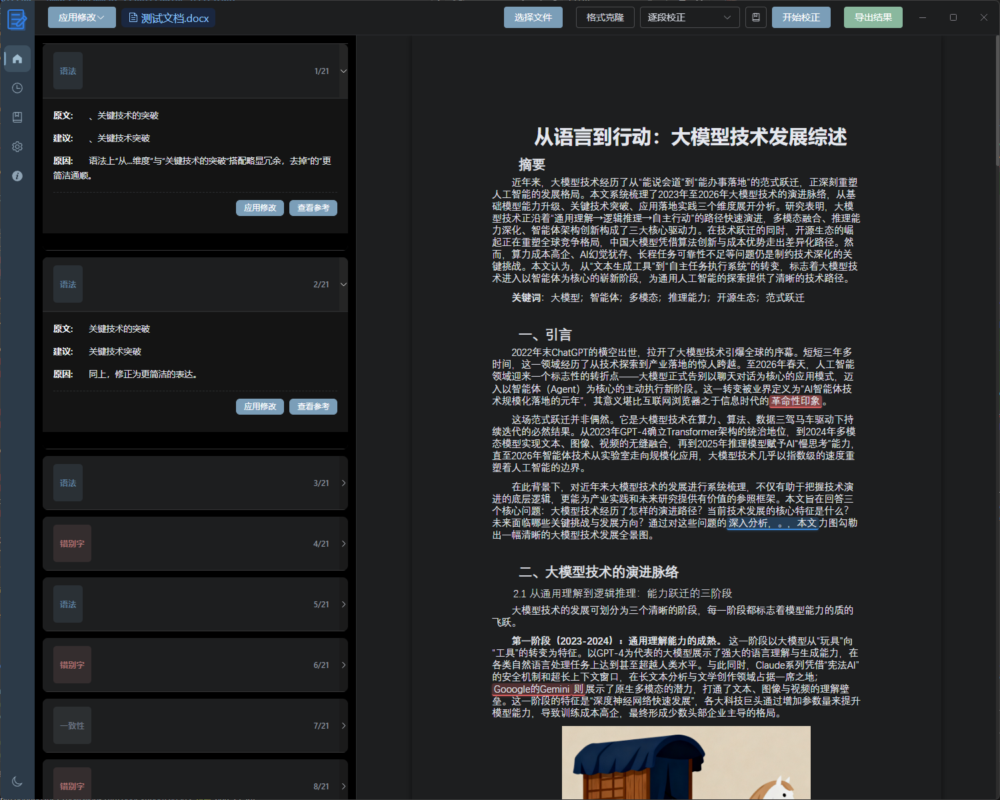

# AutoDocxProof 文档智能校对助手

<p align="right">
  <a href="README-en.md">English</a>
</p>

<p align="center">
  
</p>

<p align="center">
  一款基于 Electron、Vue 3 和 TypeScript 构建的文档校对、格式修改，降低ai率的集成化应用
</p>

## 📝 项目简介

AutoDocxProofread（智能校对）是一款专为长文档校对和论文格式优化而设计的桌面应用程序。它能够帮助用户有效检测 Word 文档中的错别字、标点符号错误、语法问题和文本一致性问题，并提供修改建议。此外还支持文字润色以降低ai检出率。并且还能进行跨文档格式克隆，一键修改全文格式。

针对大模型在处理长文档时存在的遗忘和幻觉问题，软件设计了专门的架构来增强校对的准确性，并能一键导出校对修改后的文档。并且软件采用了并行处理架构，显著提升大模型处理长文档的速度。此外还引入了本地知识库功能，支持RAG功能给模型校对参考。

针对降低ai率功能，软件采用分段并行操作形式，根据自然段对文档划分，然后调用大模型并行处理。


### 核心优势

为什么需要使用这个软件？
1. 相比使用claude code 调用skill 来对文档校对、降低ai率和格式调整，这个软件可视化效果好，可以直观检视生成效果，并且速度更快，更省token。
2. 相比使用chatgpt、豆包等网页ai应用，这个项目提供一键执行的工作流，操作便捷，省去了和大模型反复交流的精力，并且操作更快。
3. 相比于ms Office和wps等软件自带的校对系统，这个项目校对更加智能，对错误识别的种类更多样。
4. 格式调整无需用大模型，速度更快。
5. 轻量化，只需要几十MB大小，一站式解决论文最后一公里
   

### 使用展示

用户需要先在功能设置页面选择一个大模型后再开始校对操作。在文档校对页面，首先选择需要校对的文档后，再选择校对模式，选择使用的知识库（非必选），然后开始校对。软件会将校对的结果显示在右边栏，并在文本中高亮展示，以方便查看。然后可以选择是否接受这些修改，可以导出接受修改后的文档：



降低AI率功能，可以调整AI生成文本的语言风格，降低被AI检测工具识别的概率。操作过程中会自动跳过参考文献、标题等。该功能同样使用分段：


格式克隆功能，可以从参考文档中提取格式样式并应用到目标文档，并且在格式套用时还能微调参数：


本应用可以自行设置api，兼容满足openai规范的api接口，推荐使用非推理模型，并且可以限制并发请求数量和请求评率：



可以设置校对的错误类型、严格程度和文本背景，也可以自行设置提示



本应用还可以浏览和管理校对记录：



深色模式：



### ⚠️重要提醒！
- 注意：校对结果的准确度很大程度上取决于模型能力，软件无法保证校对结果的完全准确，还需要人工再次检验！
- 注意：降低ai的功能不保证有效，请严格遵循学术道德规范，自行审核！
- 注意：格式迁移功能对于段落内部单独设置的格式没有迁移能力，需要自行调整。
- 注意：软件对于word中公式的操作还不完善，如果文档中有较多公式，自动导出功能出错率更高。
- 提示：结果导出功能可能存在疏漏，建议人工核验。
- 提示：根据现有的大模型上下文记忆力，一线大模型对于1w字以下的内容可以直接选用全文校对。
- 提示，对于降低ai率和校对功能， 都建议先设置好word中的标题级别，方便软件识别分割。

### 主要功能

- **多种校对模式**：
  - 逐句精校：适合需要高精度校对的短文本
  - 逐段校正：适合长篇文献的校对
  - 全文校对：对整篇文档进行一次性校对
  - 降低AI率：调整AI生成文本的语言风格，降低被AI检测工具识别的概率

- **格式克隆**：
  - 从参考文档中提取段落样式和文本样式
  - 将提取的格式批量应用到目标文档中
  - 支持对格式样式的精细调整，包括字体、颜色、间距等

- **智能错误识别**：
  - 错别字检测
  - 标点符号错误识别
  - 语法问题检测

- **知识库系统**：
  - 创建和管理多个本地知识库
  - 支持PDF、word和txt文档导入作为参考材料
  - 基于向量数据库的RAG检索增强生成算法

- **更快的处理速度和用户友好的操作体验**：
  - 使用并行处理的方式优化处理效率，显著提升对于长文本的校对速度
  - 清晰的错误展示和修改建议
  - 一键应用修改建议，一键导出修改后的文档
  - 校正参数可调，可以适应不同任务场景

- **便捷的 API 配置管理**：
  - 兼容openai接口，支持多种大语言模型 API
  - 灵活的 API 配置管理
  - 支持对于并发数量和请求速度的设置

- **清晰的历史记录管理**：
  - 清晰查看历史记录，包括时间、校对模型、校对文件路径和具体的结果
  - 支持对结果的批量管理


## 🎯 使用指南

### 1. 配置 API

首次使用需要配置支持的大语言模型 API：

1. 点击设置
2. 点击api选项
3. 填写 API 地址、密钥和模型名称
4. 点击"测试连接"验证配置
5. 点击"保存配置"保存设置

### 2. 创建知识库

1. 点击导航栏中的"知识库"
2. 选择"Embedding模型"（需要选择专门的embedding模型）
3. 点击"添加知识库"按钮创建新知识库
4. 选择知识库后可添加PDF文件作为参考材料

### 3. 文档校对

1. 选择"文档校对"选项卡
2. 点击"选择 DOCX 文件"按钮选择要校对的 Word 文档
3. （可选）选择知识库以增强校对准确性
4. 选择合适的校对模式：
   - **逐句精校**：适合需要高精度校对的短文本
   - **逐段校正**：适合长篇文献的校对
   - **全文校对**：对整篇文档进行一次性校对
5. 点击"开始校正"按钮开始校对过程
6. 在左侧栏查看校对结果和修改建议
7. 点击"应用修改"按钮接受建议的修改（也可以撤销）
8. 点击"导出结果"按钮保存修改后的文档
   
### 4. 校正参数设置

1. 在“功能设置”页面点击提示词设置，可以选择不同的校正参数，例如文本背景、校正的严格程度和校正的错误类型
2. 也可以使用自己的提示词，使用自己的提示词的时候会关闭原始的的提示词，建议参考原始提示词进行修改，否则会影响软件的显示效果
3. 点击“恢复默认配置”可以重置上述设置

### 5. 降低ai率
1. 选择一个api提供商
2. 点击校对模式选项中的“降低ai率”
3. 点击“开始校对”
4. 结果生成成功后，可以选择接受或者拒绝
5. 点击“导出结果”按钮，导出结果


### 6. 格式克隆
1. 打开一个文件后，点击“格式克隆”按钮，切换到格式克隆模式
2. 点击左侧边栏中的“选择参考文档”，选择需要参考的文档
3. 点击右上角的“开始克隆”按钮，开始克隆
4. 左侧边栏中可以查看提取的参考文档中的格式信息，并且可以对颜色、字体大小、行距等做简单的调整
5. 点击“导出结果”导出结果

### 更新记录
- v1.1.9
  - 更新了ai格式解析功能
  - 修复了claude接口的可用性
  - 修复了gemini接口的可用性
- v1.1.8
  - 更新了降低ai的功能
  - 更新了格式迁移功能
  - 优化了格式提取功能
  - 优化校对功能中，对于全文内容概括的效果
- v1.1.7
  - 重构页面，使用体验更佳
  - 中英文双语支持
  - 新增更多的接口支持，支持模拟claude code接口请求
- v1.1.6
  - 添加进度条，用户可以实时查看校对进度
  - 优化api设置功能
  - 优化提示词设置，更加清晰方便
  - 点击校对结果可以直接跳转
- v1.1.5
  - 优化文件导出功能的操作体验
  - 优化文件导出逻辑，让错误替换更加准确
- v1.1.4
  - 新增代理功能
- v1.1.3
  - 新增了请求频率限制，优化对于第三方api转接站的支持
  - 优化深色模式显示效果
  - 新增token用量统计
  - 优化界面效果，改善交互逻辑
- v1.1.2
  - 修复全文润色模式中，不使用rag功能时无法正常校对的bug
  - 新增昼夜模式切换功能
  - 模型并发限制可调，可以适应不同的api供应商对于并发的限制要求
- v1.1.1
  - 修复rag功能可用性bug
- v1.1.0
  - 重构界面，优化使用逻辑
  - 提升软件可用性


## 🛠 技术栈

- **主框架**：[Electron](https://www.electronjs.org/) + [Vue 3](https://vuejs.org/) + [TypeScript](https://www.typescriptlang.org/)
- **UI 组件库**：[Element Plus](https://element-plus.org/)
- **构建工具**：[Vite](https://vitejs.dev/) + [Electron Forge](https://www.electronforge.io/)
- **文档处理**：[Mammoth](https://github.com/mwilliamson/mammoth.js) + [Docxtemplater](https://github.com/open-xml-templating/docxtemplater)
- **向量数据库**：[LanceDB](https://lancedb.com/)
- **代码规范**：[ESLint](https://eslint.org/) + [Prettier](https://prettier.io/)
- **版本管理**：[Standard Version](https://github.com/conventional-changelog/standard-version)

## 🚀 快速开始

### 环境要求

- Node.js >= 16.x
- npm 或 yarn

### 安装依赖

```bash
npm install
```

### 开发模式运行

```bash
npm run start
```


## 🔧 开发计划

- [ ] word文档格式校对
- [ ] 增强用户界面交互体验 （持续进行中）
- [x] 优化.docx文件的处理算法

## 📄 许可证

本项目采用 MIT 许可证 - 查看 [LICENSE](LICENSE) 文件了解详情

## 🌺 致谢

- 部分代码使用了night-peiqi的https://github.com/night-peiqi/electron-vue3-typescript-template
- 降低的ai的方案使用了linuxdo论坛用户“Chisaki”提供的方案：https://linux.do/t/topic/620470
